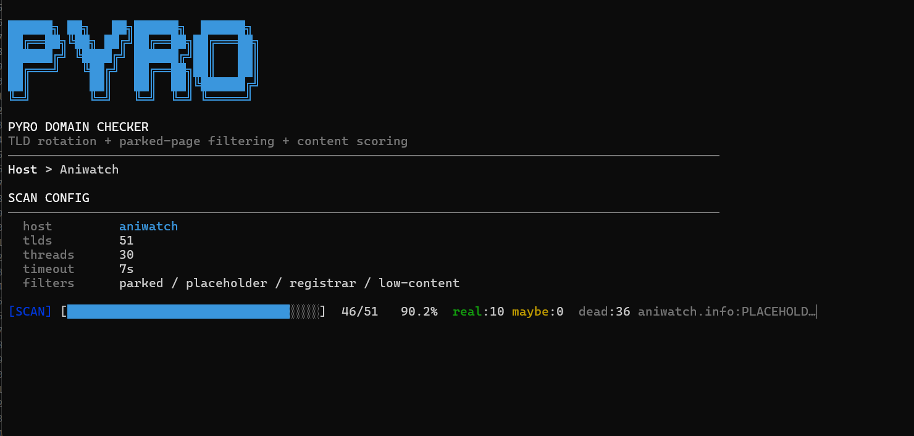

# pyro-domain-checker
A lightweight CLI tool that rotates TLDs for a given host and classifies live, parked, placeholder, and dead domains.

## Screenshots
Screenshot 2026-05-18 203611.png
### Main Scan

### Results

### Output Files

